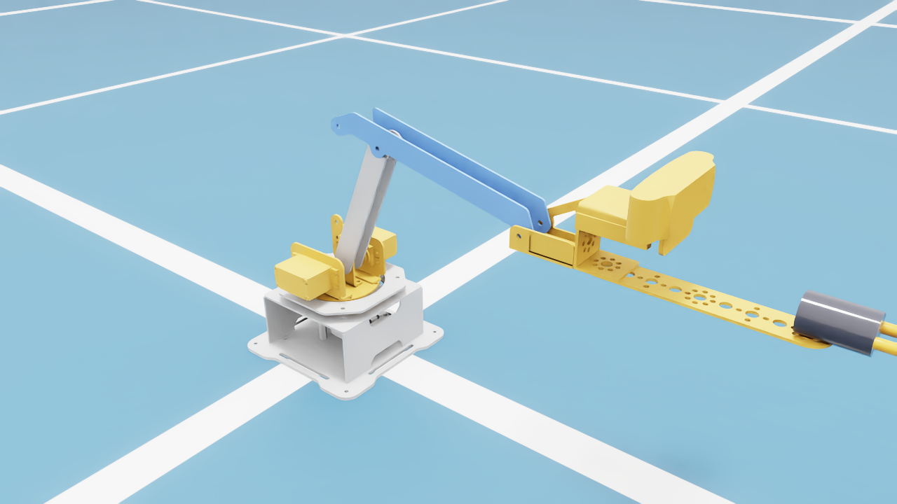
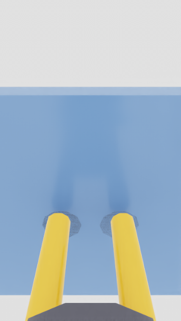

# dynamic-visual-slam-mobile-robot

Autonomous mobile manipulator with ROS 2, RealSense, dynamic visual SLAM, object
detection, and Isaac Sim simulation.

This repository will eventually hold the **complete robot**: a mobile base (with
dynamic visual SLAM + perception) carrying a manipulator arm. It is being built up
in stages:

| Stage | Contents | Status |
|-------|----------|--------|
| **1. Arm** | 4‑DOF manipulator — model, kinematics, MoveIt 2, real‑hardware driver, firmware, UIs, Isaac Sim digital twin + RL | ✅ in this repo now (`arm/`) |
| 2. Base | Mobile base — drive, RealSense, dynamic visual SLAM | ⏳ to be added |
| 3. Integration | Arm mounted on the base; whole‑robot navigation + manipulation | ⏳ to be added |

> Everything currently in this repo is the **arm**, under [`arm/`](arm/). The base and
> the integrated system will be added as later top‑level directories so the arm code
> does not need to be restructured.

---

## The arm

A 4‑DOF desktop manipulator (Hiwonder **ESPMax**, 3 serial‑bus servos driving
base / shoulder / elbow plus a **passive, mechanically‑coupled wrist** that keeps the
end‑effector level). Brought up end‑to‑end on **ROS 2 Humble**: URDF → analytic IK →
MoveIt 2 motion planning → CLI / web UIs → real‑hardware servo driver over an ESP32
running micro‑ROS, and a full **Isaac Sim 5.1** digital twin with reinforcement‑learning
reach / insertion policies.



### Packages (`arm/`)

| Package | What it is |
|---------|------------|
| `New_arm/` | Original CAD export (Blender + Phobos): STL meshes, SMURF, and the raw URDF. |
| `new_arm_description/` | ROS 2 robot description — cleaned URDF, meshes, RViz config, `display.launch.py`. |
| `new_arm_ik/` | Analytic 3‑DOF inverse kinematics (planar 2‑link seed + damped‑Newton polish), an interactive IK GUI node, and the kinematics derivation (`docs/`, with PDF). |
| `new_arm_moveit_config/` | MoveIt 2 configuration — SRDF, kinematics, OMPL/Pilz planners, controllers, and `arm_bringup.launch.py`. |
| `new_arm_driver/` | Real‑hardware bridge: maps ROS joint commands ↔ servo pulses via a calibration file, talks to the ESP32. |
| `new_arm_firmware/` | ESP32 **micro‑ROS passthrough** firmware — exposes the bus servos as ROS topics so the whole stack drives the real arm. |
| `kinematics_move/` | Original Hiwonder ESPMax vendor firmware — the reference the IK/servo math was ported from. |
| `new_arm_ui/` | Two operator front‑ends over the MoveIt stack: a CLI (`arm_cli`) and a browser web UI (`rclnodejs` + Express). |
| `new_arm_isaac/` | **Isaac Sim 5.1 digital twin + IsaacLab RL** (see below). |

### Isaac Sim digital twin + RL (`arm/new_arm_isaac/`)

The arm rebuilt in **Isaac Sim 5.1.0** with a faithful analytic FK/IK port, a ROS 2
`digital_twin.py` node that is a **drop‑in replacement for the ESP32** (the same CLI /
web / MoveIt stack drives the simulated arm unchanged), an eye‑in‑hand Logitech C920
camera baked onto the wrist, and a procedural plug‑and‑socket scene for an insertion task.

**IsaacLab reinforcement‑learning tasks** (PPO via `rsl_rl`):

| Task | Policy | Result |
|------|--------|--------|
| `NewArm-Reach-v0` | reach a 3‑D target with joint‑delta actions | ~**81%** success within 1 cm |
| `NewArm-Insert-v0` | drive the plug tip into the socket | **96.2%** terminal accuracy within 1 cm (best checkpoint) |
| `NewArm-VisionInsert-v0` | insert from **wrist‑camera obs only** (asymmetric actor‑critic) | ~**80%** peak (capped by camera field‑of‑view) |

Wrist‑camera view at the moment of insertion (RL insert policy, simulated eye‑in‑hand camera):



A trained‑reach‑policy rollout video is in [`docs/media/`](docs/media/).

For deployment, the most reliable controller is **CenterPose 6‑DoF pose → analytic
plug‑tip IK** (sub‑millimetre); the vision‑RL policy is the learned alternative for when
the socket stays in view. The Hiwonder bus servos report **no force/torque**, so contact
is sensed via a vision‑as‑force‑surrogate (`vision_align.py`) rather than a load cell.

---

## Running it

Full copy‑paste terminal recipes — build, simulate, drive from RViz / web / CLI / raw
topics, and run the real ESP32 arm — are in **[`arm/RUNBOOK.md`](arm/RUNBOOK.md)**.
Isaac Sim + RL usage is in **[`arm/new_arm_isaac/README.md`](arm/new_arm_isaac/README.md)**.

Quick orientation:

```bash
# ROS 2 Humble; source first in every terminal
source /opt/ros/humble/setup.bash
source ~/ros2_ws/install/setup.bash

# build the arm packages
colcon build --packages-select \
  new_arm_description new_arm_moveit_config new_arm_driver new_arm_ui new_arm_ik

# launch MoveIt + RViz
ros2 launch new_arm_moveit_config arm_bringup.launch.py
```

> Note: the ROS packages live under `arm/` here but are developed as a colcon workspace
> (symlinked into `~/ros2_ws/src`). Isaac Sim USD assets, RL checkpoints, and render
> dumps are intentionally **not** committed (regenerate with the `new_arm_isaac`
> scripts) — see `.gitignore`.
