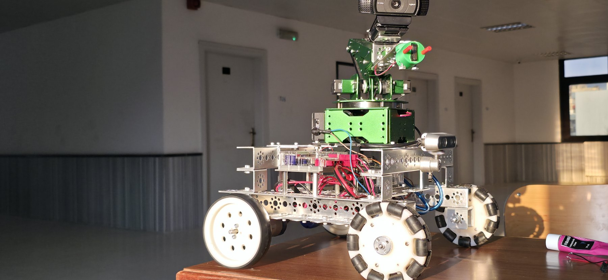
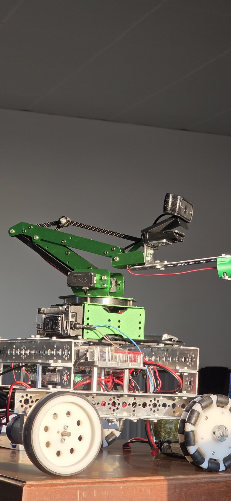
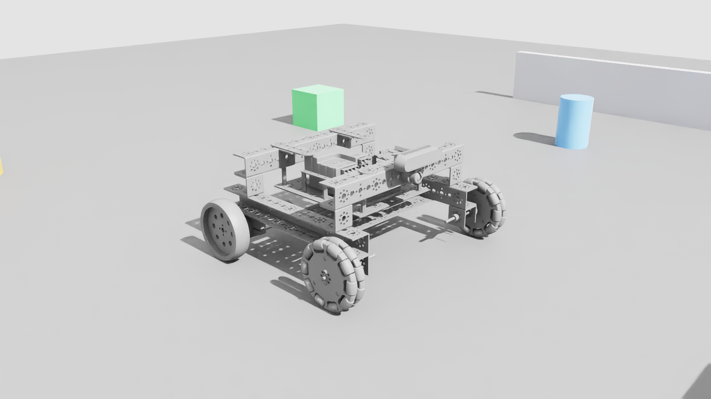

# Autonomous Differential-Drive Robot for Garage EV Charging

**A dynamic visual SLAM approach with RL-augmented precision docking.**

A mobile manipulator that drives itself to a parked electric vehicle, finds the charging
socket, and inserts the plug — combining dynamic visual SLAM, volumetric mapping, Nav2
navigation, eye-in-hand socket perception, and a PPO insertion policy under one ROS 2
state machine.

Graduation project — Department of Robotics and Intelligent Systems Engineering,
Manara University, Syria.
**Ammar Daher · Mohammad Saoud · Naya Yousef · Salman Daher**
Supervisor: Dr. Mothanna Alkubeily

📄 **[Full report (69 pages, PDF)](docs/GRADUATION_REPORT.pdf)** ·
🎥 **[Demo video](docs/media/robot_demo.mp4)**

<p align="center">
  
</p>

---

## The platform



A differential-drive base carries a 3-DoF arm with a passive, mechanically-coupled wrist
that keeps the plug level as the shoulder and elbow move. Two cameras split the job: a
base-mounted **Intel RealSense D435i** handles SLAM and mapping, while a **Logitech C920**
mounted at the wrist provides the close-range socket view used for final alignment.

| Property | Value |
|---|---|
| Base link mass | 4.5 kg (5.164 kg with wheels) |
| Dimensions (L × W × H) | 300 × 382 × 173 mm |
| Centre of mass (base frame) | (−1.2, 0.5, 30.9) mm |
| Rear drive track | 357 mm (effective turn track ≈ 560 mm) |
| Rear wheels | 2 × differential drive, 101.6 × 26.4 mm |
| Front wheels | 2 × dual-omni passive caster, 104.8 × 30.7 mm |
| Arm | 3-DoF serial chain + passive four-bar wrist |
| Compute | Raspberry Pi 4 (sensors, odometry) + laptop RTX GPU (perception, autonomy) |
| Arm actuation | Serial bus servos via ESP32 running micro-ROS |

Perception and autonomy run entirely on the laptop; the Pi only streams sensors and wheel
odometry over Wi-Fi. There is **no force sensor** on the platform — contact is inferred from
vision and a limit switch, so nothing here claims force regulation.

<br clear="right">

### Pipeline rates

| Stage | Rate |
|---|---|
| Camera RGB / depth | 30 fps @ 1280×720 |
| Dynamic visual SLAM pose update | 30 Hz, ~0.5 ms GPU |
| nvblox mesh / ESDF slice | ~14 Hz / 10 Hz |
| Nav2 control loop (`cmd_vel`) | 10 Hz |
| RL policy update | 30 Hz |

The 30 Hz camera caps everything upstream — image acquisition is the limiting factor, not
computation.

---

## Results

> **Read this section with its status column.** The project is *partially validated*. The
> mechanical platform, static SLAM, socket detection, and analytic kinematics run on real
> hardware. Dynamic-feature rejection, navigation, and the RL insertion policy are validated
> in Isaac Sim only. Structured physical insertion trials and a complete end-to-end mission
> have **not** been carried out. Simulation numbers should not be read as hardware
> performance.

### Dynamic visual SLAM — Isaac Sim, n = 32 runs per condition

| Condition | ATE [cm] | RPE [cm] | Tracking loss / run | Valid tracking [%] |
|---|---|---|---|---|
| Static | 7.9 ± 0.6 | 1.0 ± 0.3 | 0.1 | 99.6 |
| One moving object | 3.6 ± 1.0 | 1.7 ± 0.5 | 1.3 | 95.4 |
| Repeated motion | 5.4 ± 1.6 | 2.6 ± 0.9 | 3.4 | 95.8 |

Dynamic filtering holds tracking above **95.8 %** even under repeated occlusion.

### Socket detection and pose estimation — range 0.2–1.2 m

| Lighting | Translation err [mm] @0.4 m / @1.2 m | Yaw err [°] @0.4 m / @1.2 m | Detection rate [%] |
|---|---|---|---|
| Bright | 10.4 / 24.2 | 1.1 / 2.6 | 98.5 ± 1.2 |
| Normal | 14.2 / 33.0 | 2.5 / 3.9 | 94.0 ± 2.4 |
| Dim | 20.3 / 46.0 | 2.8 / 5.5 | 83.5 ± 4.1 |

The detector runs on the physical eye-in-hand camera and estimates translation; full 6-DoF
recovery — yaw in particular — is calibrated in simulation only.

### Approach navigation — Isaac Sim, n = 30 trials per scenario

| Scenario | Success [%] | Travel time [s] | Final position err [cm] | Final heading err [°] |
|---|---|---|---|---|
| S1 front | 100 | 12.4 ± 1.1 | 3.1 ± 0.6 | 2.0 ± 0.5 |
| S2 45° offset | 93.3 | 16.8 ± 1.9 | 4.7 ± 0.9 | 3.3 ± 0.8 |
| S3 cluttered | 86.7 | 22.1 ± 3.0 | 6.2 ± 1.3 | 4.8 ± 1.2 |

### Arm positioning and passive wrist

Across a 5×3 target grid, mean plug-tip position error ranges from **4 mm** (centre column,
close range) to **18 mm** (far-right cell). Passive-wrist orientation error stays below the
**5°** specification in every workspace zone, confirming the mechanical coupling assumption.

### RL insertion policy — Isaac Lab, PPO

Seating threshold is 10 mm terminal plug-tip error. The best checkpoint reaches
**96.2 %** terminal accuracy. The controlled comparison against the analytic
inverse-kinematics baseline is a *defined protocol in the report, not a completed result*.

Domain-randomization ablation (250 episodes per condition) is the strongest transfer
evidence: under all perturbations combined, the DR-trained policy loses **22 percentage
points** of terminal accuracy versus **57 points** for the policy trained without
randomization. The DR policy eliminates most timeout and target-not-reached failures, at
the cost of slightly more oscillation terminations.

### What is not yet demonstrated

| Component | Status |
|---|---|
| Mobile base, arm, wrist, camera calibration, digital twin, kinematics | ✅ hardware |
| Static ORB-SLAM3 tracking, socket YOLO detection, analytic IK | ✅ hardware |
| Dynamic-object masking, nvblox costmap, Nav2 planning | 🔶 Isaac Sim only |
| Loop closure, 6-DoF yaw estimation, force/current safety monitor | 🔶 partial |
| PPO policy on hardware | 🔶 weights transferred, single trial, no trial set |
| 30-trial physical insertion set, end-to-end autonomous mission | ⬜ planned |

---

## Repository layout

The repository holds the complete robot, built up in stages:

| Stage | Contents | Status |
|---|---|---|
| **1. Arm** | 3-DoF manipulator — model, kinematics, MoveIt 2, hardware driver, firmware, UIs, Isaac Sim twin + RL | ✅ [`arm/`](arm/) |
| **2. Base** | Mobile base — drive, RealSense, dynamic visual SLAM, Isaac Sim scenes | ✅ repo root |
| **3. Integration** | Arm on the base; whole-robot navigation + manipulation | 🔶 in progress |

### The arm — [`arm/`](arm/)

| Package | What it is |
|---|---|
| `New_arm/` | CAD export (Blender + Phobos): STL meshes, SMURF, raw URDF |
| `new_arm_description/` | ROS 2 description — cleaned URDF, meshes, RViz config |
| `new_arm_ik/` | Analytic 3-DoF IK (planar 2-link seed + damped-Newton polish) + GUI node |
| `new_arm_moveit_config/` | MoveIt 2 — SRDF, OMPL/Pilz planners, controllers |
| `new_arm_driver/` | Hardware bridge: ROS joint commands ↔ servo pulses |
| `new_arm_firmware/` | ESP32 micro-ROS passthrough firmware |
| `new_arm_ui/` | CLI (`arm_cli`) and browser web UI |
| `new_arm_isaac/` | Isaac Sim 5.1 digital twin + IsaacLab RL tasks |

IsaacLab PPO tasks (via `rsl_rl`): `NewArm-Reach-v0` (~81 % within 1 cm),
`NewArm-Insert-v0` (96.2 % terminal accuracy, best checkpoint),
`NewArm-VisionInsert-v0` (~80 % peak, capped by camera field of view).

### The base — repo root

The ROS 2 driver (`robot_drive_and_publish.py`), build and diagnostic scripts, SLAM
evaluation figures in [`figures/`](figures/), and measured platform specifications
in [`ROBOT_SPECS.md`](ROBOT_SPECS.md).

#### Isaac Sim scenes

`new_built_robot_ros.usd` is the self-contained robot-in-environment scene — the
one to open first. It holds the robot (chassis, two drive wheels, two dual-omni
casters, D435i), a ground plane, five obstacles, two walls, a dome light, and a
PhysX scene with a tire-friction table. `new_built_robot_gui.usd` is the same
scene with the operator UI graph; `lizard.usd` references it and is the stage
`ROBOT_SPECS.md` was measured from.



`env/warehouse.usd` is a larger 25.6 × 40 m warehouse (Isaac's Simple Warehouse
layout). It is a **layout-only** file: it positions 424 prop references but ships
no prop geometry, so its props resolve from NVIDIA's Isaac asset server and it
needs network access on first open. Opening it offline gives an empty shell.

---

## Running it

Copy-paste terminal recipes — build, simulate, drive from RViz / web / CLI / raw topics,
and run the real ESP32 arm — are in **[`arm/RUNBOOK.md`](arm/RUNBOOK.md)**. Isaac Sim and
RL usage is in **[`arm/new_arm_isaac/README.md`](arm/new_arm_isaac/README.md)**.

```bash
# ROS 2 Humble; source first in every terminal
source /opt/ros/humble/setup.bash
source ~/ros2_ws/install/setup.bash

# build the arm packages
colcon build --packages-select \
  new_arm_description new_arm_moveit_config new_arm_driver new_arm_ui new_arm_ik

# launch MoveIt + RViz
ros2 launch new_arm_moveit_config arm_bringup.launch.py
```

> The ROS packages live under `arm/` here but are developed as a colcon workspace
> (symlinked into `~/ros2_ws/src`). The arm's Isaac Sim USD assets, RL checkpoints, and
> render dumps are intentionally not committed — regenerate them with the `new_arm_isaac`
> scripts. The mobile base **does** commit its USD scenes at the repo root; see
> [`.gitignore`](.gitignore).

The host-side ROS 2 bringup for the integrated system (cuVSLAM + nvblox + Nav2 launch
files, params, and setup scripts) lives in a separate repository:
[`ev-charging-robot`](https://github.com/salmandaher/ev-charging-robot).
